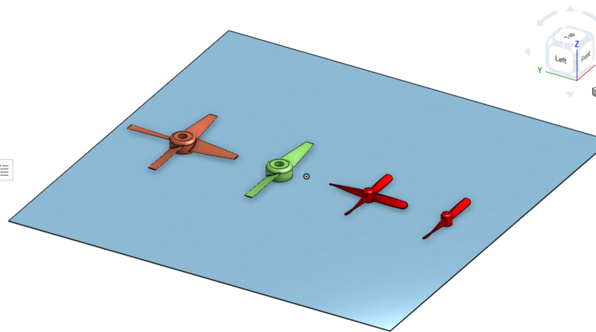
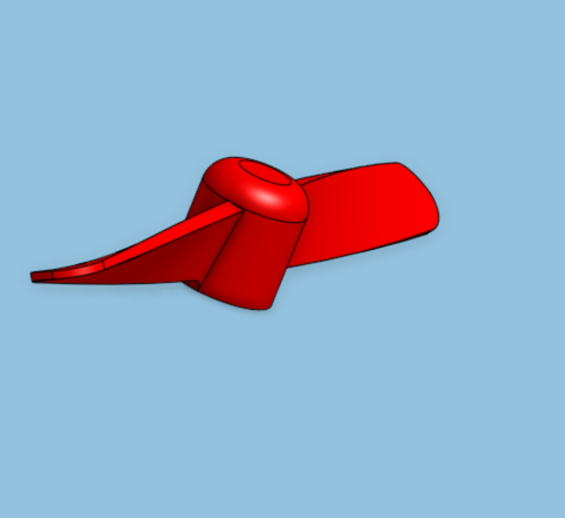
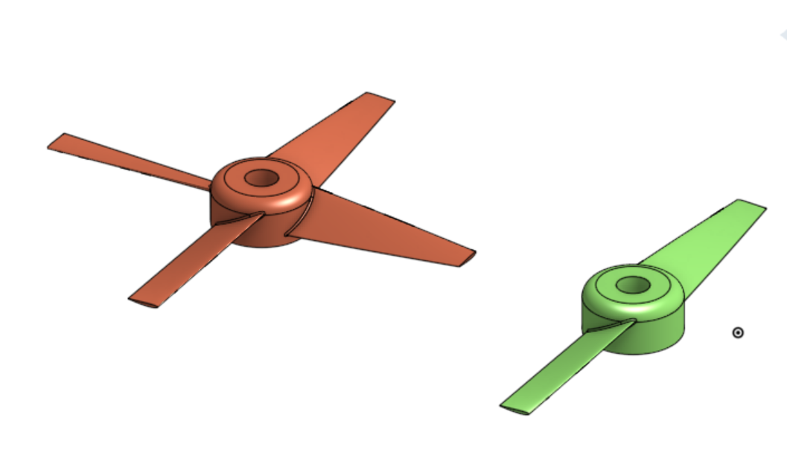

# Propeller CAD Design & Engineering Iterations (Onshape)

Welcome to the documentation for my custom propeller design project created in Onshape. This repository tracks the engineering iterations from initial flawed concepts to functional, aerodynamically viable CAD models.

---

## 🚀 Project Overview

The goal of this project was to design, model, and prepare 3D-printable propellers while learning the fundamentals of propeller aerodynamics and parametric CAD workflows in Onshape.

* *Software:* Onshape
* *Files Included:* Editable .STEP CAD source files and print-ready .STL files.
* *Key Focus Areas:* Aerofoil profiles, blade pitch angles, and rotational symmetry.

---

## 🔄 Design Evolution & Iterations



### Version 1.0: Initial Concept (Red Models)

* *Design Approach:* Relied on curved, scoop-like geometry with inconsistent blade thickness.
* *Flaws:* Created excessive rotational drag rather than efficient lift. Lacked uniform cross-sections and structural balance.

### Version 2.0: Refined Models (Green & Bronze Models)

* *Design Approach:* Shifted to defined pitch angles and aerofoil-inspired blade profiles.
* *Improvements:* Improved structural integrity, predictable forward thrust, cleaner feature tree setup using circular pattern tools, and simplified hub filleting.

---

## 🚁 How Propellers Work & Lessons Learned

A propeller functions like a rotating wing. As the blades spin, their angled orientation (*pitch*) slices through the air to push it backward, generating an equal and opposite forward force (thrust).

* *Drag vs. Lift:* My first version (red models) curved like a scoop to "catch" air, which actually created massive aerodynamic drag. I learned that blades need to slice through air, not block it.
* *Importance of Pitch:* In Version 2, establishing a uniform blade pitch allowed the propeller to act predictably and generate lift across the entire blade surface.


---

## 💨 Aerofoil Integration (Version 2)

To address the drag issues of Version 1, I researched real aircraft and drone propeller mechanics and integrated *aerofoil* principles into Version 2:

* *The Shape:* An aerofoil uses a rounded leading edge, a gently curved top body, and a tapered trailing edge.
* *Aerodynamic Efficiency:* This shape creates a pressure differential between the front and back of the blade, generating clean thrust while minimizing turbulent air resistance.
* *Onshape Implementation:* Instead of simple extrusions, Version 2 utilizes aerofoil cross-sections sketched on angled planes and extruded along the blade span at a fixed pitch.

---

## 📂 Repository Structure

```text
├── CAD/
│   ├── Propeller_v1_Red.step
│   └── Propeller_v2_Green_Bronze.step
├── STLs/
│   ├── 2_Blade_Propeller_v2.stl
│   └── 4_Blade_Propeller_v2.stl
└── Media/
    ├── RedPropellerPrototype.png
    ├── TopDownComparison.png
    └── Version2Assembly View.png
